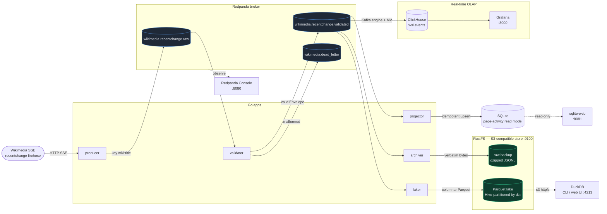

# wiki-stream-lab

A **Go** Kafka learning lab built around a real public event firehose: Wikimedia Recent Changes.

The goal is two things at once:

1. **Learn Kafka** through real streaming patterns that are hard to replace with n8n or a simple event bus: durable append-only logs, partitioning/ordering tradeoffs, consumer groups, offset replay, projection rebuilding, dead-letter handling, and consumer lag/backpressure.
2. **Learn Go** the way a tech lead learns a new language — by *reviewing* small, well-shaped pull requests. Mike is an advanced TypeScript developer becoming effective in Go fast. Every change ships as a PR small enough to review in one sitting and is written to teach one concept. See [`docs/PR_CONSTITUTION.md`](docs/PR_CONSTITUTION.md).

> Not a TypeScript/pnpm project. Implementation is Go, standard-library-first. The earlier TS scaffold direction is superseded.

## Source stream

Wikimedia Recent Changes SSE stream:

https://stream.wikimedia.org/v2/stream/recentchange

Live edits across Wikimedia projects. No API key. High enough volume to make Kafka useful.

## Target architecture



> Independent consumers read the same log. Delete SQLite and rebuild it by replaying
> Kafka history — proof the log is the source of truth. Lag demo: `--scale projector=3`
> with `SLOW_CONSUMER_MS>0`.

## Stack

- **Go 1.22+** (developed on 1.26), standard library first
- **Redpanda** in Docker Compose (Kafka-compatible broker)
- **[`segmentio/kafka-go`](https://github.com/segmentio/kafka-go)** as the Kafka client
- **[`modernc.org/sqlite`](https://pkg.go.dev/modernc.org/sqlite)** — pure-Go SQLite driver via `database/sql` (no cgo, so `CGO_ENABLED=0` builds just work)
- **`log/slog`** for structured logging
- `go test` with table-driven tests

No web framework, no ORM, no DI framework. See [`AGENTS.md`](AGENTS.md) for the full constraints.

## Run the whole thing (one command)

The entire pipeline runs as Docker services — broker, Console, the Go apps (producer/validator/projector/archiver/laker), ClickHouse, Grafana, and a RustFS object store:

```bash
docker compose up -d --build
```

That builds one image from the [`Dockerfile`](Dockerfile) (all six Go binaries), then starts everything. A one-shot `topics-init` creates the topics first; the producer runs forever (`PRODUCER_MAX_SECONDS=0`); ClickHouse ingests `validated` directly; the archiver and laker fan the same topic out to S3 (backup + Parquet lake).

```bash
docker compose ps                      # all services up
docker compose logs -f producer        # follow any service
docker compose exec projector /app/cli db inspect   # SQLite projection (in the projector container)
docker compose exec clickhouse clickhouse-client -q "SELECT count() FROM wsl.events"
docker compose down                    # stop  (add -v to wipe all data)
```

| service | port | what |
|---|---|---|
| Grafana | http://localhost:3000 | real-time dashboards (ClickHouse) |
| Redpanda Console | http://localhost:8080 | browse topics, groups, lag |
| sqlite-web | http://localhost:8081 | read-only SQL editor over the projection |
| RustFS Console | http://localhost:9101 | object store UI (`rustfsadmin` / `rustfsadmin`) |
| DuckDB web UI | http://localhost:4213 | query the Parquet lake (tools profile) |

DuckDB and the one-shot DuckDB CLI live behind the `tools` profile, so `up` doesn't start them — see [Query the lake with DuckDB](#query-the-lake-with-duckdb-pr-11--laker--parquet) below.

**Scale the lag demo** — run more projectors in the same consumer group:

```bash
docker compose up -d --scale projector=3   # 3 consumers share the 6 partitions
SLOW_CONSUMER_MS=1000 docker compose up -d projector   # or slow it down to build lag
```

> Prefer host `go run` for Go dev iteration (below); use Docker to run the full system. On this machine `docker` is a podman shim — `podman machine start` first if compose can't connect.

## How this project is built and reviewed

Work lands as a sequence of small PRs (PR 0..8). Each PR teaches one concept, stays well under ~300 changed lines where reasonable, includes tests, and **stops for Mike's review before the next one starts**. The roadmap lives in [`docs/CC_IMPLEMENTATION_PLAN.md`](docs/CC_IMPLEMENTATION_PLAN.md); the rules every PR follows live in [`docs/PR_CONSTITUTION.md`](docs/PR_CONSTITUTION.md).

## Local broker + topics (PR 3 — works now)

```bash
docker compose up -d            # start Redpanda + Console; broker on localhost:19092
go run ./cmd/cli topics create  # create the pipeline topics (idempotent)
go run ./cmd/cli topics list    # list topics on the broker
```

Console UI: http://localhost:8080 · stop with `docker compose down` (add `-v` to wipe the log).

Topics created (partition counts per [ADR 0002](docs/adr/0002-partition-key-wiki-page-id.md)):

| topic | partitions | why |
|---|---|---|
| `wikimedia.recentchange.raw` | 6 | scales the consumer-group lag demo |
| `wikimedia.recentchange.validated` | 6 | same |
| `wikimedia.dead_letter` | 1 | low volume, ordering-insensitive |

> On this machine `docker` is a podman shim — run `podman machine start` first if compose can't connect.

## Other commands

```bash
# build / test
go build ./...
go test ./...
go vet ./...

# producer (PR 4 — works now): live SSE -> raw topic, keyed wiki:title
go run ./cmd/producer                       # live; stops after PRODUCER_MAX_SECONDS
go run ./cmd/producer -file events.sse      # replay SSE from a file (offline/demo)

# validator (PR 5 — works now): raw -> validated (Envelope), malformed -> dead_letter
go run ./cmd/validator           # consumer group "validator"; Ctrl-C to stop

# projector (PR 6 — works now): validated -> SQLite page-activity, idempotent
go run ./cmd/projector           # consumer group "projector"; Ctrl-C to stop

# archiver (PR 10): validated -> verbatim gzipped JSONL backup in S3 (RustFS)
go run ./cmd/archiver            # consumer group "archiver-raw"; needs S3_* env

# laker (PR 11): validated -> columnar Parquet lake in S3, Hive-partitioned by dt=
go run ./cmd/laker               # consumer group "lake-parquet"; needs S3_* env
```

> The archiver and laker need `S3_ENDPOINT` / `S3_ACCESS_KEY` / `S3_SECRET_KEY` / `S3_BUCKET` (see `.env.example`). Easiest is to run them in Docker where those are already wired.

Inspect the read model (PR 7 — `cli db`, no SQL needed):

```bash
go run ./cmd/cli db inspect    # counts, top pages, per-wiki stats
go run ./cmd/cli db reset      # delete the SQLite projection
```

Prove idempotency — replay the validated topic and watch counts NOT change:

```bash
docker compose exec redpanda rpk group seek projector --to start  # rewind offsets
go run ./cmd/projector   # logs applied:0 skipped_duplicates:N; SQLite rows unchanged
```

## Replay / rebuild from the log (PR 7)

The SQLite projection is disposable — the Kafka log is the source of truth. Delete the read model and rebuild it from history:

```bash
go run ./cmd/cli db inspect                         # note the numbers
go run ./cmd/cli db reset                            # 1. delete the projection
docker compose exec redpanda rpk group seek projector --to start   # 2. rewind offsets to earliest
go run ./cmd/projector                               # 3. replay -> rebuilds identically
go run ./cmd/cli db inspect                          # same numbers as before
```

Because the projector is idempotent (dedupe on `event_id`), the rebuild is exact — running it again changes nothing.

**Retention note:** replay only goes back as far as the broker still has data. Redpanda keeps the log per its retention config (effectively unbounded for this single-node dev setup, until you `docker compose down -v`). In production you'd size retention — or use a compacted topic — to control how far back you can rebuild.

Inspect the validator's output:

```bash
docker compose exec redpanda rpk topic consume wikimedia.recentchange.validated -n 1 -o start -f '%v\n'
# {"event_id":"...","event_type":"edit","wiki":"enwiki","title":"...","user":"...","bot":false,"occurred_at":...}
docker compose exec redpanda rpk topic consume wikimedia.dead_letter -n 1 -o start -f '%v\n'
# {"reason":"invalid recentchange event: missing meta.id","source_topic":"...","partition":2,"offset":0,"raw":"..."}
```

Prove the producer worked — consume a couple of raw messages back:

```bash
docker compose exec redpanda rpk topic consume wikimedia.recentchange.raw -n 2 -o start -f '%k => %v\n'
# enwiki:Go (programming language) => {"wiki":"enwiki","title":"Go (programming language)",...}
```

## Backpressure / consumer lag (PR 8)

Consumer **lag** = messages written but not yet processed by a group. Slow the projector to make lag build, then scale the group to drain it.

```bash
go run ./cmd/cli lag                                   # per-partition + total lag (group projector)

docker compose exec redpanda rpk group seek projector --to start   # rewind so the backlog is pending
go run ./cmd/cli lag                                   # total lag == backlog size

SLOW_CONSUMER_MS=500 go run ./cmd/projector            # one slow consumer — Ctrl-C after a bit
go run ./cmd/cli lag                                   # lag only partly drained; it can't keep up
```

Now run **several** projectors in separate terminals (same `projector` group):

```bash
SLOW_CONSUMER_MS=500 go run ./cmd/projector   # terminal 1
SLOW_CONSUMER_MS=500 go run ./cmd/projector   # terminal 2
SLOW_CONSUMER_MS=500 go run ./cmd/projector   # terminal 3
go run ./cmd/cli lag                           # drains faster — work is shared across the group
```

Observed in a run: backlog 20 → one slow consumer left 9 → scaling cleared it to 0.

**The partition ceiling:** the topics have **6 partitions**, and each partition is consumed by at most one member of a group. So adding consumers speeds the drain only **up to 6**; a 7th sits idle. That is the fundamental scaling limit Kafka makes explicit — and why the partition count (and key choice, [ADR 0002](docs/adr/0002-partition-key-wiki-page-id.md)) matters. You can also watch lag live in the Redpanda Console (http://localhost:8080) or via `rpk group describe projector`.

## Real-time insight dashboard (PR 9 — ClickHouse + Grafana)

The enterprise pattern: **Redpanda → ClickHouse (real-time OLAP) → Grafana**. ClickHouse ingests the `validated` topic *directly* via its Kafka table engine — no consumer code — and Grafana queries it for sub-second, drill-down insight (throughput, event type, top wikis, last 10 events, total). This is the analytics layer; arbitrary group-by belongs here, not in ops metrics.

```bash
docker compose up -d            # now also starts ClickHouse + Grafana
go run ./cmd/cli topics create  # if not already
go run ./cmd/producer           # feed the firehose
go run ./cmd/validator          # raw -> validated (ClickHouse reads validated)

open http://localhost:3000      # Grafana, dashboard "wiki-stream-lab (ClickHouse)" (anonymous)
```

How it flows:

```text
validated topic
   │  ClickHouse Kafka engine (consumer group "clickhouse")  ← no app code
   ▼
wsl.kafka_validated ──(materialized view)──► wsl.events (MergeTree)
                                                 │
                                          Grafana (ClickHouse datasource)
```

Query it directly too:

```bash
docker compose exec clickhouse clickhouse-client -q \
  "SELECT event_type, count() c FROM wsl.events GROUP BY event_type ORDER BY c DESC"
docker compose exec clickhouse clickhouse-client -q \
  "SELECT wiki, count() c FROM wsl.events GROUP BY wiki ORDER BY c DESC LIMIT 5"
```

ClickHouse is **one of five independent consumer groups** on the log (alongside `validator`, `projector`, `archiver-raw`, `lake-parquet`) — the same event stream, read again for a different purpose. All local, no cloud. (ClickHouse is also what Tinybird runs managed — same SQL transfers.)

## Raw backup to object storage (PR 10 — archiver + RustFS)

Two more consumer groups fan the `validated` topic out to an S3-compatible store ([RustFS](https://github.com/rustfs/rustfs)) — the same enterprise split as Kafka → S3 (backup) + Kafka → lakehouse (query). RustFS speaks the S3 API on host `:9100`, console on `:9101`.

The **archiver** (`cmd/archiver`, group `archiver-raw`) writes a *verbatim* gzipped JSONL backup: each line is the validated message's bytes exactly as they sat in Kafka, so the backup replays back onto the topic with no decode step. The lesson is crash-safety: **offsets commit only after the object lands in S3**, so a crash before commit re-reads and rewrites the same key (offset range) — at-least-once delivery, idempotent storage.

```bash
docker compose logs -f archiver                        # watch objects land
docker compose exec rustfs sh -c 'ls -R /data/wiki-stream-lab'   # backup objects
```

## Query the lake with DuckDB (PR 11 — laker + Parquet)

The **laker** (`cmd/laker`, group `lake-parquet`) builds the curated, query-optimized copy: columnar **Parquet**, Hive-partitioned by event date (`dt=YYYY-MM-DD/`) so a date filter prunes whole files. Rows are batched into a row group in memory before each file is written (the batch is the encoder's working set, not a durability buffer — Kafka is the durable log). Same offset-after-write discipline as the archiver.

Query it with **DuckDB** — no local install needed. Both run against the lake in RustFS over S3 (`httpfs`):

```bash
# one-shot interactive CLI (tools profile)
docker compose run --rm duckdb
# then:  SELECT wiki, count(*) FROM lake GROUP BY 1 ORDER BY 2 DESC LIMIT 10;

# or the browser notebook UI
docker compose --profile tools up -d duckdb-ui   # http://localhost:4213
```

Two reads of one log, two shapes: ClickHouse for sub-second live dashboards, the Parquet lake for cheap columnar history on object storage. DuckDB and ClickHouse's `s3()` read the *same* Parquet files.

## Browse the projection in your browser (sqlite-web)

The projector's SQLite read model is also exposed as a **read-only** SQL editor at **http://localhost:8081** ([sqlite-web](https://github.com/coleifer/sqlite-web)). Read-only so it never contends with the projector's writes.

## Key docs

- Product plan: [`docs/PRD.md`](docs/PRD.md)
- Go implementation plan + PR roadmap: [`docs/CC_IMPLEMENTATION_PLAN.md`](docs/CC_IMPLEMENTATION_PLAN.md)
- PR constitution (how every PR is shaped): [`docs/PR_CONSTITUTION.md`](docs/PR_CONSTITUTION.md)
- Agent instructions / constraints: [`AGENTS.md`](AGENTS.md)
- Domain glossary: [`CONTEXT.md`](CONTEXT.md)
- Architecture decisions: [`docs/adr/`](docs/adr/)
