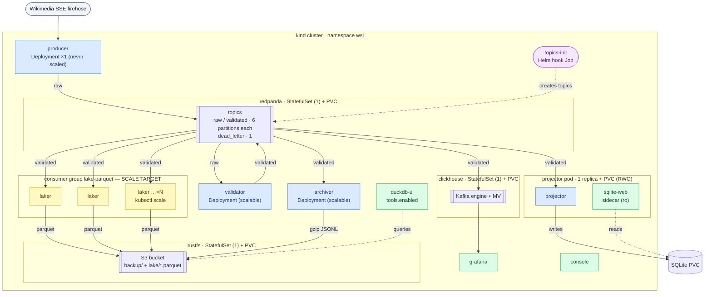

# Design: Kubernetes migration (cloud-ready, scalable consumer groups)

Date: 2026-06-29
Status: approved (brainstorming) — pending spec review

## Goal

Make the wiki-stream-lab stack cloud-ready and demonstrate Redpanda
scalability natively on Kubernetes: adding a worker to a consumer group is
`kubectl scale deploy/<consumer> --replicas=N`, a new pod joins the group, and
the topic's partitions rebalance across pods.

Run locally on **kind** now; the same chart deploys to a cloud cluster via a
Kustomize overlay. Docker Compose stays in place and working — k8s is added
alongside, not a rip-and-replace.

Non-goals (deliberately deferred):
- Kafka operator (Strimzi / Redpanda Operator). Single-node Redpanda
  StatefulSet is enough to teach scaling of *consumers*. Operator is a
  separate future learning track.
- Multi-broker Redpanda HA. Dev-container mode, `--smp=1`, one replica.
- Real production secrets. Dev creds only; cloud overlay references an
  externally-created Secret by name.

## Constraints honored

- Kafka stays central; no substitute bus.
- Real source firehose; producer is a singleton (never scaled).
- No secrets committed to the repo.
- Staged, small, reviewable PRs per `docs/PR_CONSTITUTION.md`.
- Compose remains the documented local path until Mike chooses to retire it.

## Architecture



Yellow `laker` pods are the headline scale target: `kubectl scale` adds pods to
group `lake-parquet`, the 6 validated-topic partitions rebalance across them.

## Component → Kubernetes mapping

| Compose service | k8s object | Rationale |
|---|---|---|
| redpanda | StatefulSet (1) + headless Service + PVC | stable network id + durable log |
| clickhouse | StatefulSet (1) + PVC + ConfigMap (init.sql, kafka.xml) | durable OLAP data |
| rustfs | StatefulSet (1) + PVC | durable object store |
| console | Deployment + ClusterIP | stateless UI |
| grafana | Deployment + ClusterIP + ConfigMaps (provisioning, dashboards) | stateless UI |
| producer | Deployment, **1 replica, never scaled** | singleton firehose source |
| validator | Deployment (scalable consumer group) | stateless |
| laker | Deployment (scalable consumer group) | **headline scale-out demo; S3 sink, no shared state** |
| archiver | Deployment (scalable consumer group) | S3 sink, no shared state |
| projector | Deployment, **1 replica**, + PVC, **sqlite-web sidecar** | SQLite single-writer; sidecar shares PVC so RWO works |
| topics-init | Helm hook Job (post-install, post-upgrade) | runs once before apps |
| duckdb / duckdb-ui | gated by `values.tools.enabled` | maps the Compose `tools` profile |

### The SQLite wrinkle and decision

In Compose, projector (writer) and sqlite-web (reader) share a named volume.
k8s RWO PVCs are single-node, single-writer, so the two containers run in
**one pod**: projector + sqlite-web sidecar, both mounting one PVC (sqlite-web
read-only). Consequence: projector stays single-replica — correct anyway, the
projection is one logical SQLite and the log is the source of truth.

Therefore the scale-out demo moves off projector onto **laker/archiver**
(stateless S3 sinks). Consumer-lag is still demonstrable on any consumer via
`SLOW_CONSUMER_MS`.

## Scale-out demo (the point of this work)

`wikimedia.recentchange.raw` and `wikimedia.recentchange.validated` have **6
partitions** each (`internal/kafka/topics.go`), so a consumer group scales
cleanly up to 6 active pods.

```bash
kubectl scale deploy/laker --replicas=4
# 4 pods join consumer group "lake-parquet"; 6 partitions rebalance.
kubectl run lag --rm -it --image=wiki-stream-lab:local -- \
  /app/cli lag lake-parquet wikimedia.recentchange.validated
```

## Tooling: Helm + Kustomize

- **Helm = packaging.** One chart owns release lifecycle, values, templates.
- **Kustomize = per-environment config**, run as a Helm **post-renderer**:
  `helm install wsl ./chart --post-renderer ./overlays/local/kustomize.sh`.
  Overlays patch ingress, StorageClass, resource requests, and Secret refs
  without forking the templates. Single source of truth.

## Directory layout (new; Compose untouched)

```text
deploy/k8s/
  chart/
    Chart.yaml
    values.yaml               # dev defaults: S3 creds, image tag, tools.enabled=false
    templates/
      redpanda.yaml
      clickhouse.yaml
      clickhouse-config.yaml  # ConfigMap from init.sql + kafka.xml
      rustfs.yaml
      console.yaml
      grafana.yaml            # + ConfigMaps from provisioning/dashboards
      producer.yaml
      validator.yaml
      laker.yaml
      archiver.yaml
      projector.yaml          # + sqlite-web sidecar
      topics-init-job.yaml    # helm hook: post-install, post-upgrade
      secret.yaml             # S3 creds from values
      _helpers.tpl
  overlays/
    local/                    # kind: port-forward, local-path SC, small resources
    cloud/                    # Ingress, real StorageClass, external Secret, registry image
  kind-cluster.yaml           # 1 control-plane + 2 workers
  README.md
```

## Networking

- In-cluster: `KAFKA_BROKERS=redpanda:9092` via headless Service DNS. Redpanda
  advertises `redpanda.<ns>.svc:9092` to pods.
- Host access (local): `kubectl port-forward` for UIs (grafana 3000, console
  8080, sqlite-web 8081, rustfs console 9101) and the broker when needed.
- Cloud overlay: NodePort/Ingress instead of port-forward.

## Images

Go apps already build to a single image (`wiki-stream-lab:local`); each
Deployment's `command` selects the binary (`/app/producer`, `/app/laker`, …).
Keep that. Local flow: `podman build` → `kind load docker-image`. Values
expose `image.{repository,tag,pullPolicy}`; cloud overlay swaps to a registry
reference.

## Secrets

S3 creds templated into a Secret from `values.yaml` (dev defaults only). No
real secrets committed. Cloud overlay references an externally-created Secret
by name.

## Run flow (local)

```bash
kind create cluster --config deploy/k8s/kind-cluster.yaml
podman build -t wiki-stream-lab:local .
kind load docker-image wiki-stream-lab:local
helm install wsl deploy/k8s/chart \
  --post-renderer deploy/k8s/overlays/local/kustomize.sh
kubectl get pods -w
kubectl port-forward svc/grafana 3000:3000
```

## Staged PR breakdown

Each PR is one reviewable unit, leaves Compose working, and follows the
handoff format in `docs/PR_CONSTITUTION.md`.

- **PR-k1 — Redpanda on k8s.** Chart skeleton (Chart.yaml, values, _helpers),
  redpanda StatefulSet + headless svc + PVC, topics-init Helm hook Job, kind
  config, README. Verify: broker healthy, topics created, `cli lag` from a pod.
- **PR-k2 — Pipeline apps.** producer, validator, projector (+ sqlite-web
  sidecar) Deployments + image-load flow. Verify: projection fills; sqlite-web
  shows rows.
- **PR-k3 — Object + lake.** rustfs StatefulSet, archiver, laker Deployments,
  S3-creds Secret. Verify: Parquet objects land in rustfs.
- **PR-k4 — OLAP + UIs.** clickhouse StatefulSet (+ ConfigMaps), grafana,
  console, provisioning ConfigMaps. Verify: Grafana dashboard live.
- **PR-k5 — Scale-out + cloud overlay.** Kustomize local + cloud overlays,
  ingress, `tools.enabled` (duckdb-ui). Document the headline scaling demo
  (rebalance + lag). Verify: `kubectl scale` shows partitions rebalance.

## Verification per PR

Run the closest available checks (kind cluster, `kubectl`, `helm template`,
`helm lint`) and paste real output into the handoff. If a step cannot run,
report the exact command, blocker, and next command.
